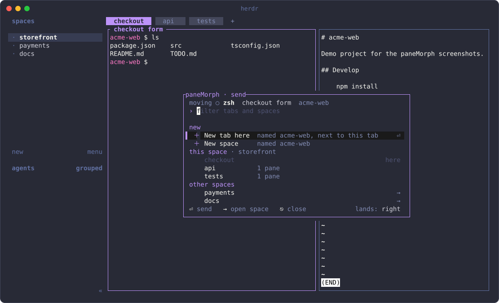
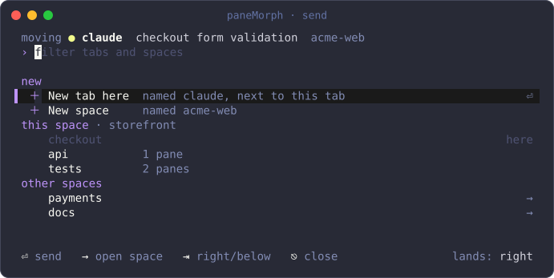
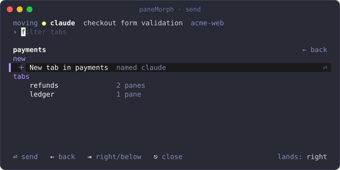
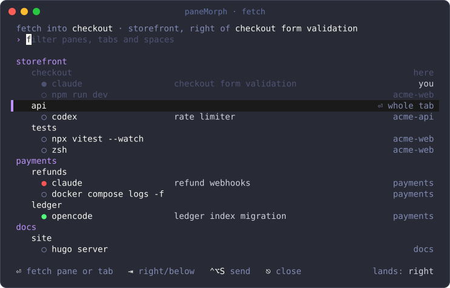
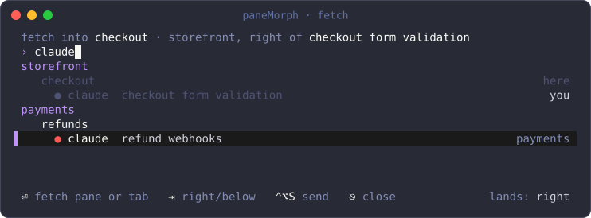
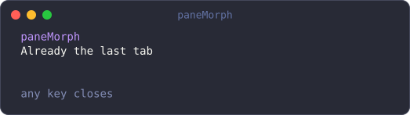
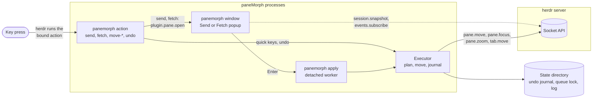

<div align="center">

# paneMorph

**Send any pane anywhere. Fetch any pane here. Keep your terminals running.**

A [herdr](https://herdr.dev) plugin that moves live panes between tabs and spaces.

[](https://github.com/Jenish-Shobhit/paneMorph/actions/workflows/ci.yml)
[](https://github.com/Jenish-Shobhit/paneMorph/releases/latest)
[](LICENSE)
[](https://herdr.dev)
[](https://www.rust-lang.org)

[Install](#install) · [Keybindings](#keybindings) · [Usage](#usage) · [How it works](#how-it-works) · [Troubleshooting](#troubleshooting) · [Changelog](CHANGELOG.md)

</div>

<p align="center">
  
</p>

## Why

herdr gives each agent and each command its own pane, but work rarely stays
where it started: a test runner belongs beside the agent that broke the
tests, and a long-running agent deserves a space of its own. herdr can move a
live pane anywhere through its socket API; paneMorph puts that behind two
keys and a filterable list of destinations, named the way you named them.

## Features

- **Send (⌃⌥S).** Move the focused pane to any tab, a new tab next to this
  one, a tab in another space, or a new space.
- **Fetch (⌃⌥F).** Bring any pane, or a whole tab with its splits and
  ratios, into the tab you are in.
- **Quick keys.** New tab, new space, previous or next tab, without opening a
  window.
- **Undo (⌃⌥Z).** Put the last 20 moves back, one press at a time: same
  neighbour, same side, same ratio, with closed tabs and spaces recreated in
  their old places.
- **Live moves only.** Every move is herdr's `pane.move`. Processes,
  scrollback and working directories survive; paneMorph never closes or
  restarts a terminal.
- **Names, not ids.** Rows show each pane's status, agent or running command,
  title and folder. New tabs and spaces are named after the pane.
- **Built for fast hands.** Type to filter every list at once, presses queue
  in order, windows refresh as herdr changes, and errors stay inline.
- **Local only.** No telemetry and no network: paneMorph talks to herdr's
  Unix socket and nothing else.

## Requirements

- [herdr](https://herdr.dev) **0.9.0** or newer. **0.9.1** is recommended
  (see [herdr 0.9.0 and 0.9.1](#herdr-090-and-091)).
- macOS or Linux.
- To build from source: Rust **1.89** or newer (`cargo` on your `PATH`). The
  prebuilt archives need no Rust toolchain.

## Install

### From GitHub

```sh
herdr plugin install Jenish-Shobhit/paneMorph --ref v0.2.0
```

herdr clones the tag, shows the manifest and the build command it will run,
runs `cargo build --release --locked`, and registers the plugin. Add `--yes`
to skip the confirmation. herdr has no `plugin update`; run the same command
with a newer `--ref` to upgrade.

### Prebuilt binaries

Each [release](https://github.com/Jenish-Shobhit/paneMorph/releases/latest)
has a ready-to-link plugin directory for `aarch64-apple-darwin`,
`x86_64-apple-darwin`, `x86_64-unknown-linux-musl` and
`aarch64-unknown-linux-musl`, with a SHA-256 checksum:

```sh
version=v0.2.0
target=aarch64-apple-darwin   # pick yours from the list above
base=https://github.com/Jenish-Shobhit/paneMorph/releases/download/$version
curl -fLO "$base/panemorph-$version-$target.tar.gz"
curl -fLO "$base/panemorph-$version-$target.tar.gz.sha256"
shasum -a 256 -c "panemorph-$version-$target.tar.gz.sha256"

mkdir -p ~/.local/share/herdr-plugins
tar -xzf "panemorph-$version-$target.tar.gz" -C ~/.local/share/herdr-plugins
herdr plugin link ~/.local/share/herdr-plugins/panemorph-$version-$target
```

`plugin link` runs no build step, so the included binary is used as is. On
macOS, an archive downloaded with a browser is quarantined; clear it with
`xattr -dr com.apple.quarantine ~/.local/share/herdr-plugins/panemorph-$version-$target`.

### From a local checkout

```sh
git clone https://github.com/Jenish-Shobhit/paneMorph.git
cd paneMorph
cargo build --release
herdr plugin link "$PWD"
```

herdr reads the manifest from disk on every key press, so after `git pull`
only `cargo build --release` is needed. Until the build exists, the keys log
"paneMorph is not built" in `herdr plugin log list`.

To remove paneMorph, run `herdr plugin uninstall dev.panemorph` for a GitHub
install or `herdr plugin unlink dev.panemorph` for a linked directory.

## Keybindings

Installing a plugin binds no keys. Merge this into
`~/.config/herdr/config.toml` (the same file is in
[config/panemorph-keys.toml](config/panemorph-keys.toml)), then run
`herdr config check` and `herdr server reload-config`.

| Key | Action | What it does |
| --- | --- | --- |
| ⌃⌥S | `dev.panemorph.send` | Open Send for the focused pane |
| ⌃⌥F | `dev.panemorph.fetch` | Open Fetch |
| ⌃⌥T | `dev.panemorph.move-tab-new` | Move the pane to a new tab next to this one |
| ⌃⌥N | `dev.panemorph.move-space-new` | Move the pane to a new space named after its folder |
| ⌃⌥← | `dev.panemorph.move-tab-prev` | Move the pane one tab left |
| ⌃⌥→ | `dev.panemorph.move-tab-next` | Move the pane one tab right |
| ⌃⌥Z | `dev.panemorph.undo` | Put the last moved pane back |

```toml
[[keys.command]]
key = "ctrl+alt+s"
type = "plugin_action"
command = "dev.panemorph.send"
description = "Send pane"

[[keys.command]]
key = "ctrl+alt+f"
type = "plugin_action"
command = "dev.panemorph.fetch"
description = "Fetch a pane here"

[[keys.command]]
key = "ctrl+alt+t"
type = "plugin_action"
command = "dev.panemorph.move-tab-new"
description = "Pane to a new tab"

[[keys.command]]
key = "ctrl+alt+n"
type = "plugin_action"
command = "dev.panemorph.move-space-new"
description = "Pane to a new space"

[[keys.command]]
key = "ctrl+alt+left"
type = "plugin_action"
command = "dev.panemorph.move-tab-prev"
description = "Pane one tab left"

[[keys.command]]
key = "ctrl+alt+right"
type = "plugin_action"
command = "dev.panemorph.move-tab-next"
description = "Pane one tab right"

[[keys.command]]
key = "ctrl+alt+z"
type = "plugin_action"
command = "dev.panemorph.undo"
description = "Undo the last move"
```

Any key works; these are suggestions. Inside a window, ⌃⌥S and ⌃⌥F switch
between Send and Fetch, and the other chords are ignored. paneMorph leaves
⌃⌥M to [codeMap](https://github.com/Jenish-Shobhit/codeMap).

**v0.1 bindings keep working.** `extract-pane`, `send-pane` and `bring-pane`
(v0.1's `ctrl+e`, `ctrl+s` and `ctrl+f`) are aliases for `move-tab-new`,
`send` and `fetch`, and log a one-line deprecation note. They are removed in
v1.0.

## Usage

### Send

Press ⌃⌥S. A popup opens over herdr; nothing zooms and the layout stays
visible underneath. The top line names the pane that moves.

<p align="center">
  
</p>

- Type to filter every list at once. ↑ ↓ select, ⏎ sends.
- **New tab here** opens a tab right after this one; **New space** opens one
  at the bottom of the sidebar. Names come from the pane: its agent, else its
  running command, else its folder, with " 2", " 3" when taken.
- Your current tab is dimmed and marked **here**.
- ⇥ switches where the pane lands: right of, or below, the target tab's
  focused pane. Focus goes with the pane.

⏎ or → on another space opens it, with **New tab in ‹space›** on top. ←
goes back.

<p align="center">
  
</p>

### Fetch

Press ⌃⌥F to list every pane in every space, grouped space, tab, pane. Panes
without an agent show their running command.

<p align="center">
  
</p>

- ⏎ on a **pane** row brings that pane beside yours.
- ⏎ on a **tab** row brings the whole tab and rebuilds its splits beside
  yours. The emptied tab closes.
- ⇥ switches right or below. You stay on your own pane.

Filtering matches agent, command, title, folder, tab and space names:

<p align="center">
  
</p>

In either window, ⎋ or ⌃C closes without moving anything. Errors appear in
the footer and the window stays open.

### Quick keys and undo

⌃⌥T, ⌃⌥N, ⌃⌥← and ⌃⌥→ move the focused pane without a window.

- Nothing wraps: ⌃⌥→ on the last tab says "Already the last tab".
- ⌃⌥T on a pane that is alone in its tab does nothing, and neither does ⌃⌥N
  on a pane alone in its space.
- Fast presses queue, so ⌃⌥→ twice moves the pane two tabs over.
- A zoomed tab is unzoomed for the move. The tab you look at stays unzoomed;
  a tab elsewhere is zoomed again.

⌃⌥Z puts the last move back, beside the same neighbour at the same ratio, and
recreates a tab or space the move had closed. Each press undoes the next
older move, up to 20 per herdr session.

When herdr's toasts are off (its default), a quick key that cannot act says
so in a small notice popup that closes on any key or after four seconds:

<p align="center">
  
</p>

### Try it without herdr

`cargo run -- preview send` (or `fetch`) opens a window over a simulated
session, and `--fixture FILE` loads your own, in the format of
[examples/screenshots/demo-session.json](examples/screenshots/demo-session.json).

## Configuration

paneMorph has no settings file of its own. It follows herdr's configuration,
which it reads but never writes (from `HERDR_CONFIG_PATH`, else
`$XDG_CONFIG_HOME/herdr/config.toml`, else `~/.config/herdr/config.toml`).

| herdr setting | Default | Effect on paneMorph |
| --- | --- | --- |
| `[[keys.command]]` | none | Which keys run which paneMorph action. See [Keybindings](#keybindings). |
| `[ui] mouse_capture` | `true` | When on, a click selects a row, a double click acts and the wheel scrolls. When off, the windows ignore the mouse, and ⎋ closes them faster. |
| `[ui.toast] delivery` | `"off"` | When off, a quick key that fails opens paneMorph's notice popup. Otherwise herdr shows a toast. |

paneMorph keeps its state in the plugin state directory herdr gives it:
the undo journal (`journal-*.json`), the key queue lock (`queue.lock`) and
`panemorph.log` (the last 500 lines). Action output also appears in
`herdr plugin log list`.

## How it works



- **One binary, several roles.** herdr runs `./bin/panemorph <action>` for a
  key. `send` and `fetch` ask herdr to open a popup that runs
  `panemorph window`; the quick keys act directly.
- **Plan, then move.** A move is planned from one `session.snapshot` by pure
  functions ([src/plan.rs](src/plan.rs), [src/topology.rs](src/topology.rs)),
  then carried out with `pane.move`, `pane.swap`, `pane.zoom`, `pane.focus`,
  `tab.move` and `workspace.move` only. paneMorph never calls `layout.apply`
  or any `close`, so no terminal restarts.
- **Whole tabs** are replayed split by split. If a step fails, the panes
  already moved go back to their exact places.
- **A detached worker** finishes a window's move. herdr closes a popup when
  its tab closes, which happens when you send that tab's last pane; the
  worker completes the move, the undo journal and the log regardless.
- **Undo** is a journal of the last 20 moves per herdr session, keyed by
  terminal id, which stays stable when a pane changes tab or space.
- **Tests** run the planners and executor against an in-memory herdr
  ([src/sim.rs](src/sim.rs)), render the windows into ratatui's test
  backend, drive the real binary through a pseudo-terminal, and, opt-in,
  exercise every key on a throwaway herdr server
  ([docs/verification.md](docs/verification.md)).

## Troubleshooting

**A key does nothing.** Check that the snippet is merged and reloaded
(`herdr config check`), then read `herdr plugin log list`. To rule out the
binding, run an action directly inside herdr:
`herdr plugin action invoke send --plugin dev.panemorph`.

**"paneMorph is not built".** Run `cargo build --release` in the plugin
directory, or use a [prebuilt archive](#prebuilt-binaries).

**Check the connection and versions.** From the plugin directory, inside
herdr, run `./bin/panemorph doctor`. It is read-only and reports the herdr
version, the numbers of spaces, tabs and panes, and the undo journal.

**⎋ takes a moment to close a window.** The window exits 1 to 2 ms after it
receives ⎋, but with mouse capture on (herdr's default) herdr holds a lone ⎋
for up to 150 ms to tell it apart from a mouse report, so ⎋ to closed is
about 165 ms. With `[ui] mouse_capture = false` it is about 40 ms. **⌃C
always closes at once.**

**⌃⌥Z zooms instead of undoing.** herdr keeps its own `keys.zoom` when both
use `ctrl+alt+z`, and `herdr config check` reports the clash. Keep one.

**A chord never reaches herdr on Linux.** GNOME and some terminals take
`ctrl+alt+arrows`, Ubuntu and Fedora take `ctrl+alt+t`, and Konsole takes
`ctrl+alt+s`. Bind those actions to other keys.

**Undo says "Nothing to undo" after a restart.** A herdr restart or live
handoff gives every terminal a new id, so the journal no longer matches and
is cleared rather than guessed at.

### herdr 0.9.0 and 0.9.1

paneMorph runs on 0.9.0 and recommends 0.9.1. On 0.9.0, a move that asks
herdr to follow the pane changes herdr's focus but not your view
([herdr#4153](https://github.com/herdrdev/herdr/issues/4153)), so paneMorph
calls `pane.focus` right after the move. The view then follows within 10 to
25 ms, against about 10 ms on 0.9.1, and a key pressed inside that gap can
still reach the pane you left. With Homebrew:

```sh
brew upgrade herdr
herdr server stop   # ends every pane process; agents with herdr integrations resume
herdr
```

A client-only update leaves the old server running, and Homebrew installs
cannot hand off live.

## Roadmap

- **v1.0:** remove the deprecated v0.1 action ids (`extract-pane`,
  `send-pane`, `bring-pane`).
- Verify the ⌃⌥ chords in common Linux desktops and terminals, and document
  the conflicts.
- Under consideration: sending a whole tab to another space from Send, and a
  preview of a pane's recent output in Fetch.

Ideas and requests are welcome as
[issues](https://github.com/Jenish-Shobhit/paneMorph/issues/new/choose).

## Contributing

Bug reports and focused pull requests are welcome. [CONTRIBUTING.md](CONTRIBUTING.md)
covers the development setup, the checks CI runs, live tests on a throwaway
herdr server, and the commit style. Everyone taking part follows the
[code of conduct](CODE_OF_CONDUCT.md).

## Security

Report vulnerabilities privately through
[GitHub's private vulnerability reporting](https://github.com/Jenish-Shobhit/paneMorph/security/advisories/new).
See [SECURITY.md](SECURITY.md) for scope and what to include.

## License

[MIT](LICENSE) © 2026 Jenish Shobhit

---

**Sibling project:** [codeMap](https://github.com/Jenish-Shobhit/codeMap)
(⌃⌥M) shows your code as a map and flowcharts, and what your agents changed,
inside herdr.
